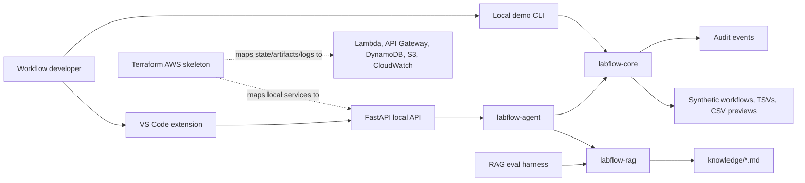

# LabFlow AI Studio

LabFlow AI Studio is a local-first, AI-assisted workflow development studio for synthetic NGS quantification, normalization, RNA re-quantification, and downstream QC provenance workflows.

It is built as a portfolio project for AI/LIMS platform work: deterministic lab workflow logic, retrieval over domain documentation, evals, guarded tool-using agents, VS Code workflow diagnostics, a FastAPI boundary, and AWS-shaped infrastructure.

For the role-focused portfolio path, start with:

- [Role alignment](docs/role_alignment_starlims.md)
- [Five-minute demo script](docs/demo_script_starlims_role.md)
- [Portfolio eval summary](docs/eval_summary.md)
- [Share readiness checklist](docs/share_readiness_checklist.md)

## What This Is

- A synthetic LIMS workflow development environment.
- A deterministic lab engine for wells, containers, quantification, normalization, split workflows, in-place normalization, RNA re-quantification, downstream QC provenance, JANUS-style previews, audit records, and readiness checks.
- A local RAG system over synthetic domain docs with citations and no-answer behavior.
- A controlled agent runtime that calls deterministic tools rather than inventing lab facts.
- A VS Code extension skeleton for LabFlow workflow YAML diagnostics and API-backed commands.
- A production-shaped architecture prototype with Terraform for Lambda, API Gateway, DynamoDB, S3, IAM, and CloudWatch.

## What This Is Not

- Not a production LIMS.
- Not a clinical or diagnostic system.
- Not a robot controller.
- Not a STARLIMS clone or proprietary SOP reproduction.
- Not a system for patient, customer, or real lab data.
- Not a full bioinformatics pipeline; it does not parse FASTQ, align reads, call variants, or perform clinical QC.
- Not a live-inference demo by default. Current demos and tests use deterministic/local components for reproducibility.

All demo data is synthetic.

## Architecture



Core package boundaries:

- `packages/labflow-core`: deterministic lab/LIMS workflow engine.
- `packages/labflow-rag`: markdown corpus loading, chunking, retrieval, citations, answer/eval support.
- `packages/labflow-agent`: guarded local tool-using runtime with deterministic planner/model metadata.
- `apps/api`: FastAPI routes for workflows, tools, RAG, agent, evals, audit, and artifacts.
- `apps/vscode-extension`: workflow diagnostics, hover docs, and API-backed commands.
- `infra/terraform`: AWS-shaped skeleton only; no deployment is required.

See [docs/architecture.md](docs/architecture.md) for a deeper architecture walkthrough.

## Quickstart

Requirements:

- Python 3.12
- `uv`
- Node/npm for the VS Code extension compile
- Terraform only if validating `infra/terraform`

Run the core verification suite:

```sh
make test
make lint
make type
```

Run the synthetic demo:

```sh
python3 scripts/run_demo.py
```

Run the demo without changing checked-in expected artifacts:

```sh
python3 scripts/run_demo.py --output-dir /tmp/labflow-demo
```

Run the interactive RAG demo:

```sh
python3 scripts/rag_demo.py
```

Run RAG evals:

```sh
python3 scripts/run_rag_evals.py --retrieval-only
```

Run the portfolio readiness check:

```sh
make portfolio-check
```

Regenerate the curated eval summary:

```sh
make eval-summary
```

Validate the Terraform skeleton after installing Terraform:

```sh
terraform -chdir=infra/terraform init -backend=false
terraform -chdir=infra/terraform validate
```

Do not run `terraform apply` unless you explicitly intend to mutate an AWS account.

## Demo Flow

Stage 16 added the core local demo, and Stage 19 extends it with synthetic
downstream QC provenance:

1. Validate `examples/workflows/invalid_rna_norm_requant.workflow.yaml`.
2. See deterministic errors for missing blank, missing concentration, invalid standards, and JANUS blocking.
3. Validate `examples/workflows/fixed_rna_norm_requant.workflow.yaml`.
4. Generate a dry-run JANUS-style preview for the fixed workflow.
5. Confirm split workflow and in-place normalization rows in `examples/expected/janus_rna_preview.csv`.
6. Ingest `examples/qc/synthetic_ngs_qc_results.csv`.
7. Generate a dry-run lab-to-analysis lineage report.
8. Ask the agent to explain a downstream QC failure with cited policy and no invented root cause.
9. Review retrieval-only eval results in `examples/expected/eval_report.json`.

The walkthrough is in [docs/demo_walkthrough.md](docs/demo_walkthrough.md).

## Core Capabilities

- Canonical units: ng/uL, uL, ng.
- Valid wells: A1-H12, with standard wells A1-H1.
- 96-well sample plate rule: 95 samples plus one blank.
- Varioskan TSV parsing with schema mapping.
- Linear standard curve fitting.
- Quantification flow: blank correction, standard curve, dilution factor, stock concentration.
- DNA and RNA normalization planning.
- Split workflow when calculated transfer is below 1 uL.
- In-place normalization when source volume constraints require it.
- RNA re-quant downstream concentration handling.
- Synthetic downstream NGS QC summary parsing.
- Configurable read-count and Q30 threshold evaluation.
- Lab-to-analysis lineage reports linking quantification, normalization, re-quantification, and downstream QC by sample ID.
- JANUS-style dry-run CSV preview.
- Structured exceptions, ancestry, and audit events.
- Throughput simulation for one-container versus multi-container batching.

## RAG, Evals, Agent, And Guardrails

The RAG layer loads synthetic markdown docs from `knowledge/`, chunks them into stable citation IDs, and retrieves citation-ready context. Unsupported questions return an explicit unsupported answer instead of a fabricated response.

The eval harness checks retrieval, citation proxy metrics, answer-term matching, disallowed-answer violations, tool-call expectations, latency, and prompt/model metadata. Golden cases live in `evals/golden_questions.yaml`.

The agent runtime is read-only by default. It can retrieve docs and call deterministic tools such as `validate_batch`, but lab truth stays in `labflow-core`. State-changing behavior requires dry-run first; commit-style artifact generation remains blocked unless approval infrastructure is present.

## VS Code Extension

The extension in `apps/vscode-extension` provides:

- LabFlow YAML diagnostics through the local API.
- Hover documentation for workflow fields.
- commands for validation, diagnostic explanation, workflow explanation, JANUS dry-run, eval suite, and audit events.

It is a developer-tooling skeleton for the portfolio demo, not a packaged marketplace extension.

## Tests

Current verification includes:

- `make test`: Python unit/integration tests across core, RAG, agent, and API.
- `make lint`: Ruff checks.
- `make type`: mypy strict checks plus VS Code TypeScript compile.
- `terraform validate`: local validation for the AWS skeleton when Terraform is installed.

Latest local verification should be checked with the commands above before sharing.

## Limitations

- Synthetic data only.
- No clinical, diagnostic, or production use.
- No production LIMS integration.
- No robot execution.
- No auth, tenancy, or enterprise deployment hardening.
- No live model provider by default.
- No FASTQ parsing, alignment, variant calling, differential expression, or clinical QC logic.
- Terraform is a skeleton, not an applied cloud environment.
- JANUS output is a preview format for demonstration, not a certified robot-ready artifact.

See [docs/limitations_and_disclosure.md](docs/limitations_and_disclosure.md).

## Case Study

The portfolio case study is in [docs/case_study.md](docs/case_study.md). It explains the background problem, deterministic engine, RAG/eval layer, guardrails, developer platform, AWS-shaped architecture, and tradeoffs.

For interview preparation, see [docs/role_alignment_starlims.md](docs/role_alignment_starlims.md) and [docs/interview_review_quiz.md](docs/interview_review_quiz.md).
