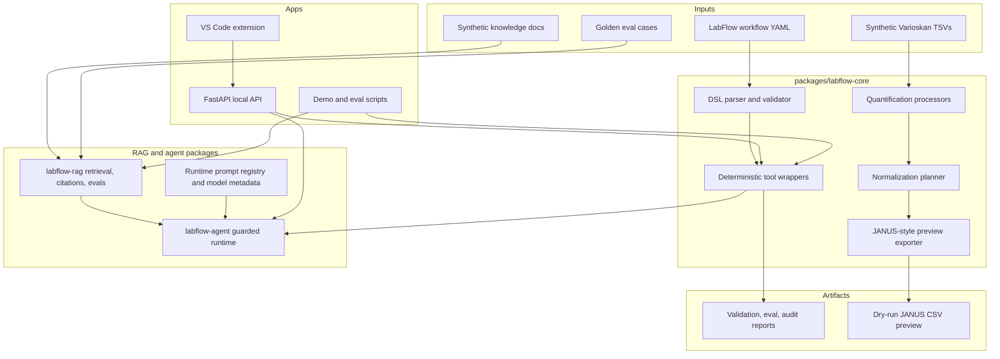
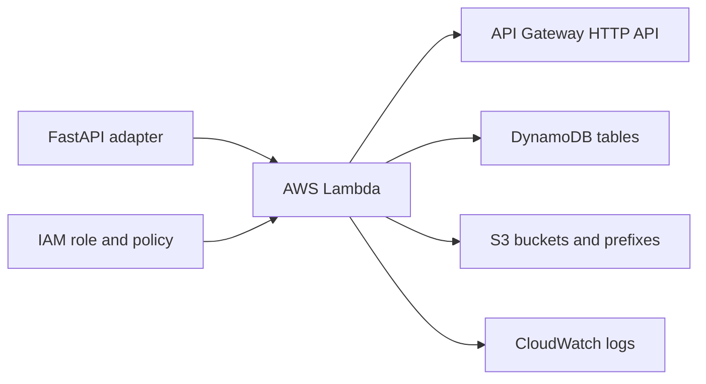

# LabFlow Architecture

LabFlow AI Studio is organized as a local-first monorepo. The key design choice is that deterministic lab workflow logic owns safety-critical truth, while AI-facing components retrieve, explain, plan, and call tools around that deterministic core.

## System View

## Deterministic Core

`labflow-core` contains no LLM dependency. It owns:

- units and volume constraints;
- A1-H12 well parsing and ordering;
- Matrix 96 x 1 mL container models;
- Varioskan TSV parsing;
- standard curve fitting;
- DNA/RNA quantification and normalization planning;
- split workflow and in-place normalization;
- RNA re-quant downstream concentration handling;
- JANUS-style dry-run CSV rows;
- exception, ancestry, audit, readiness, and throughput models.

The core rule is simple: invalid inputs produce structured exceptions and invalid samples do not generate robot transfers.

## RAG Layer

`labflow-rag` loads markdown files from `knowledge/`, creates stable chunk IDs, retrieves source chunks, and returns citation metadata. It is deliberately local and deterministic for tests and demos.

The eval harness uses `evals/golden_questions.yaml` to measure retrieval coverage, citation proxy behavior, answer-term matching, disallowed terms, tool-call expectations, and latency. Stage 16's demo eval is retrieval-only so it proves corpus coverage without claiming live model answer quality.

## Agent Layer

`labflow-agent` combines:

- deterministic planning through the current fake/local model adapter;
- RAG retrieval for grounded context;
- deterministic tool execution through `labflow-core`;
- guardrail policy for dry-run and approval behavior;
- prompt/model metadata and traces.

The current runtime is intentionally conservative. It can answer supported questions and call tools, but it cannot make deterministic lab truth by itself.

## API And VS Code

`apps/api` exposes local routes for workflow validation, RAG, agent questions, deterministic tools, evals, audit, and artifacts.

`apps/vscode-extension` provides a developer environment for LabFlow workflow YAML files:

- diagnostics;
- hover docs;
- validate workflow command;
- diagnostic explanation command;
- workflow explanation command;
- JANUS dry-run command;
- eval and audit commands.

## AWS-Shaped Skeleton

The Terraform skeleton maps local components to a plausible AWS deployment shape:

Modeled resources include Lambda API, API Gateway, DynamoDB tables for workflows/audit/evals/artifacts/prompts, S3 buckets and prefixes for knowledge/instrument/artifacts/eval reports, IAM roles and policies, and CloudWatch log groups.

This is not deployed by default. It validates locally with Terraform and exists to show production-shaped boundaries.

## Safety Boundaries

- RAG answers must cite retrieved chunks or say unsupported.
- The agent is read-only by default.
- State-changing actions require dry-run first.
- Commit actions require approval infrastructure.
- Every tool call creates an audit event.
- JANUS preview generation is blocked for invalid batches.
- Molar targets are out of scope.
- Synthetic data only.
