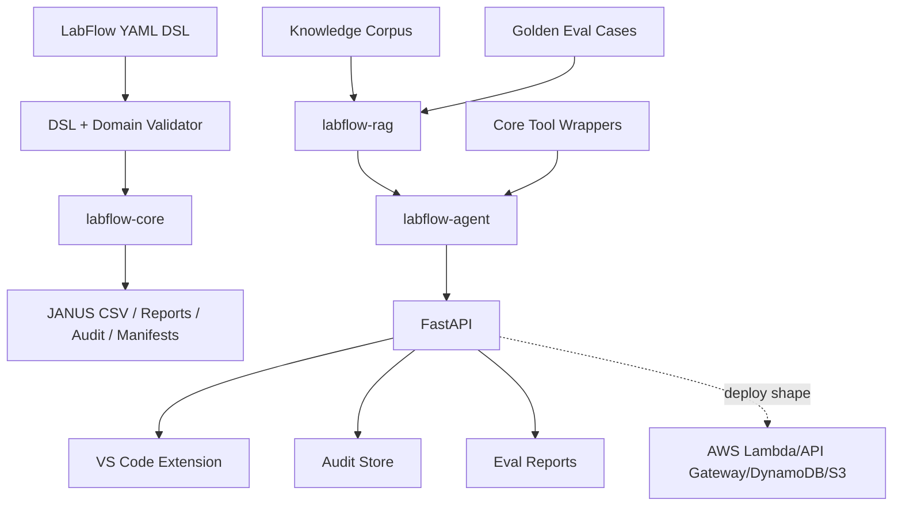
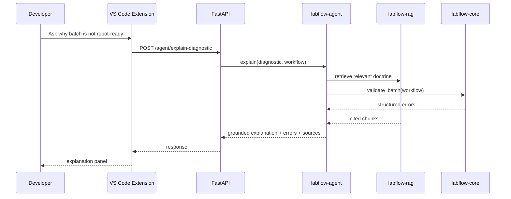
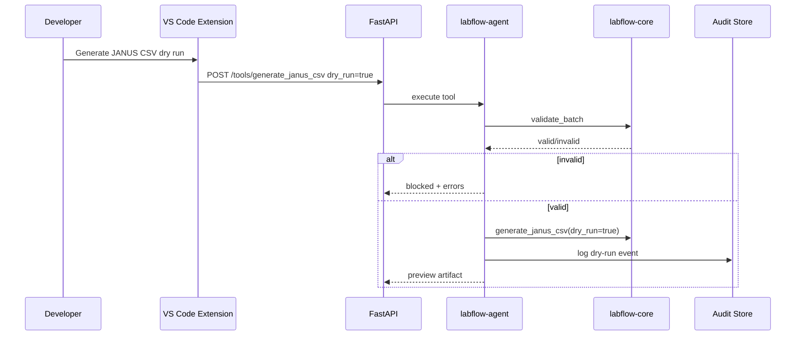

# Architecture Specification

## Overview

LabFlow AI Studio is a monorepo with deterministic lab workflow logic at the center and AI capabilities layered around it.

## Local-first architecture

The project must run locally without cloud credentials:

- SQLite or JSONL local store.
- Local document index.
- Mock model adapter or test model stub for evals.
- Optional environment variables for real LLM/embedding calls.

## Package responsibilities

### labflow-core

No LLM dependency. Owns deterministic lab workflow rules.

### labflow-rag

Owns retrieval over knowledge corpus and eval support.

### labflow-agent

Owns controlled tool orchestration, policy checks, audit, and grounded answer composition.

### API

Provides unified boundary for VS Code extension and demos.

### VS Code extension

Primary developer UX. Must be thin and call API for heavy logic.

## Data flow: explain failed batch

## Data flow: generate JANUS CSV

